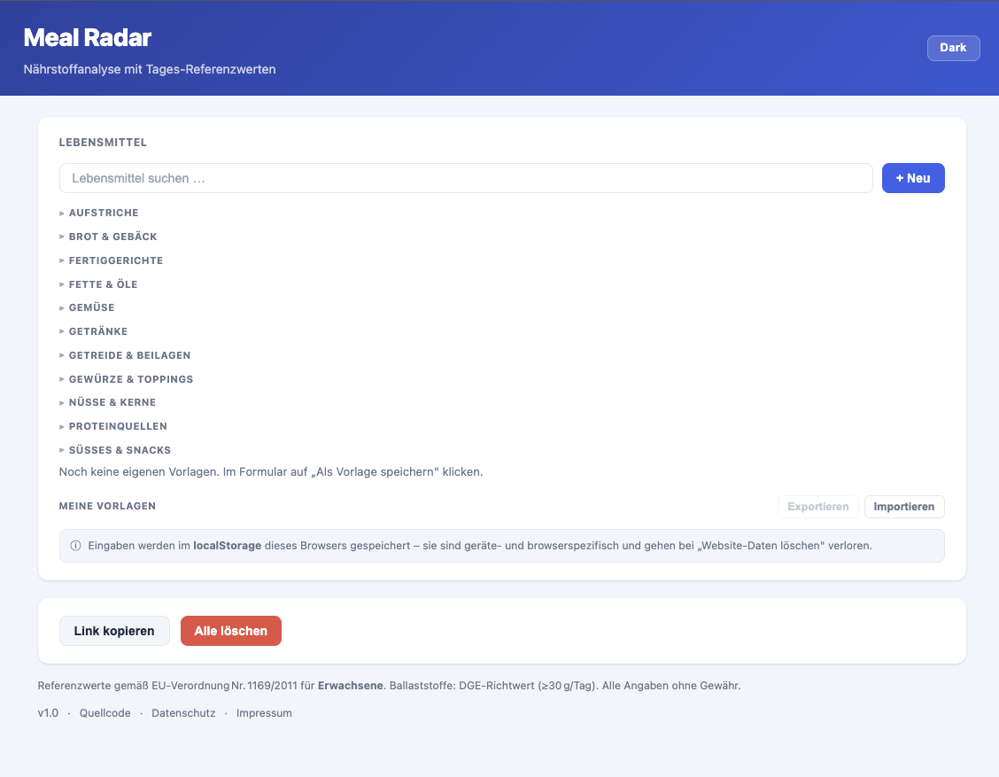
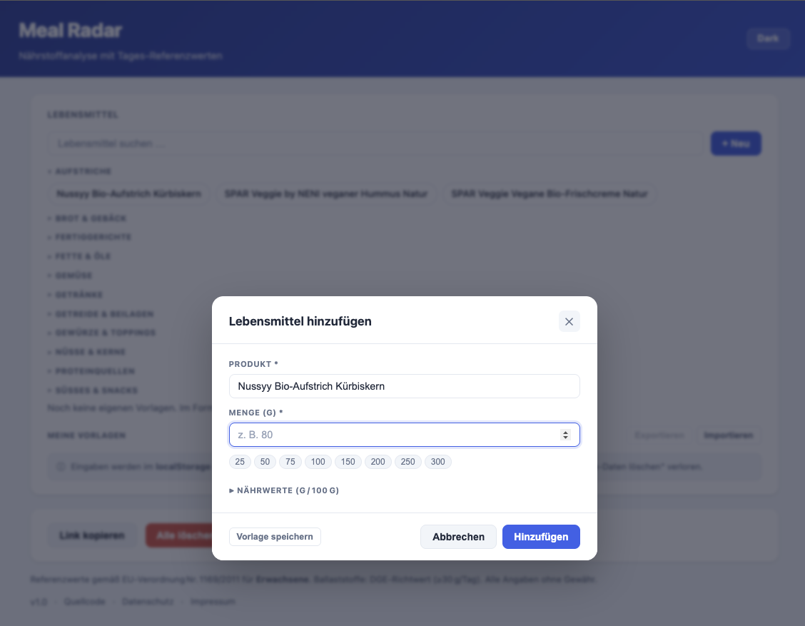
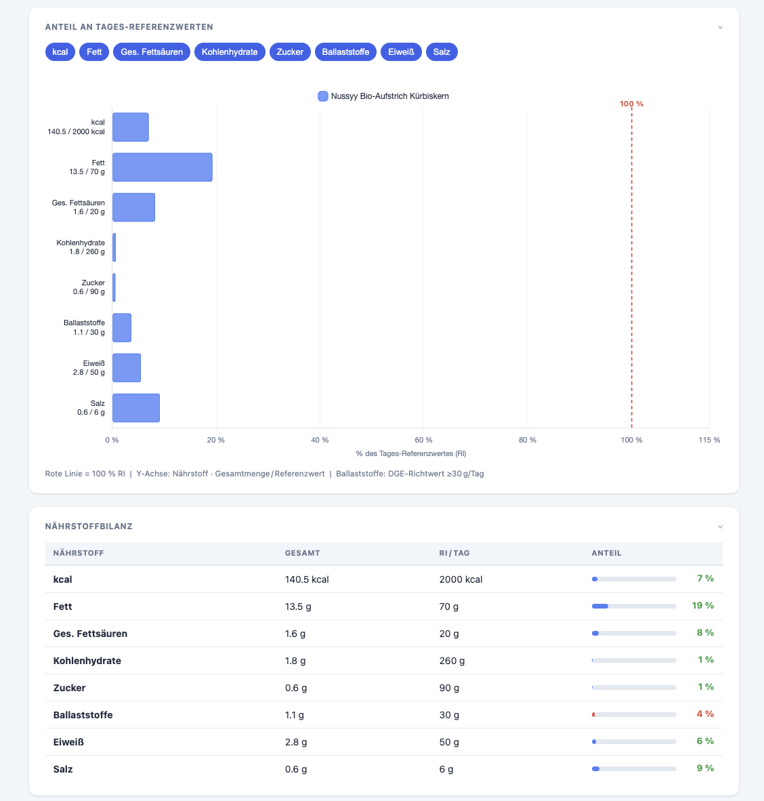

# Meal Radar
A single-page web app for nutritional analysis of meals. Add foods, enter their nutrient values per 100&nbsp;g, and see the totals visualized as a percentage of the EU daily reference intake (RI). Works entirely in the browser, no server, no build step.


## Features
- Add foods with nutrient values per 100&nbsp;g (kcal, fat, saturated fat, carbs, sugar, fiber, protein, salt)
- Save reusable food templates for quick entry
- Live search through your saved templates
- Stacked horizontal bar chart showing each nutrient's share of the EU daily reference intake
- 100&nbsp;% RI reference line drawn directly on the chart
- Toggle individual nutrients on/off in the chart
- Full nutrient summary table with totals and percentages
- Light & dark theme with system-preference detection
- Shareable links: meal state is encoded in the URL (`?d=…`) and updates automatically
- One-click "Link kopieren" to share the current meal
- Responsive layout for mobile and desktop


## How To Use

> Hosted version: open the GitHub Pages URL of this repo, or [Macusercom/Meal-Radar](https://github.com/Macusercom/Meal-Radar).

1. Click **+ Neu** to add a food item.

2. Enter the product name, the amount in grams, and the nutrient values per 100&nbsp;g (typically taken from the package label).

3. (Optional) Click **Vorlage speichern** to keep the food as a reusable template.

4. The chart and the nutrient table update automatically. The red line marks 100&nbsp;% of the EU daily reference intake.

5. Click **Link kopieren** to copy a shareable URL containing the full meal.

### Run locally
This is a static site. Either open `index.html` directly in your browser, or serve the folder with any static server, e.g.:

```
python3 -m http.server 8000
```

Then open `http://localhost:8000`.


## Reference Values
Reference intakes follow EU Regulation No.&nbsp;1169/2011 for adults. Fiber uses the DGE recommendation (≥30&nbsp;g/day).

| Nutrient          | RI&nbsp;/&nbsp;day |
|-------------------|--------------------|
| Fett              | 70&nbsp;g          |
| Ges. Fettsäuren   | 20&nbsp;g          |
| Kohlenhydrate     | 260&nbsp;g         |
| Zucker            | 90&nbsp;g          |
| Ballaststoffe     | 30&nbsp;g          |
| Eiweiß            | 50&nbsp;g          |
| Salz              | 6&nbsp;g           |


## Tech
- Vanilla HTML, CSS, JavaScript &mdash; no framework, no build step
- [Chart.js&nbsp;4.4](https://www.chartjs.org/) via CDN for the stacked bar chart
- Meal state is serialized as `btoa(encodeURIComponent(JSON.stringify(foods)))` and stored in the `?d=` URL parameter

All data stays in your browser. No tracking, no backend, no analytics.


## Images





